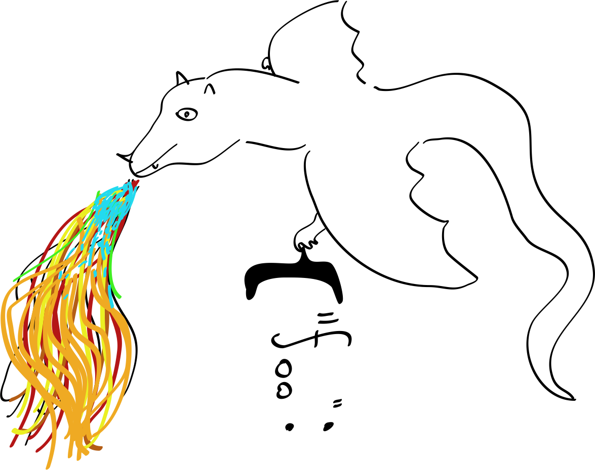

# smaug

Here be dragons.

Ever tried to parse complex data formats? Sure, you can use regular
expressions, but they only get you so far. And parsing more complex structures
becomes tedious and awkward. And also much harder to get right.

Say you wanted to write a JSON parser. Oh, there already is one called
`json_decode`? Ok. Say you wanted to write an
[edn](https://github.com/edn-format/edn) parser. It's better than JSON because
it's extensible.

How would you do it? You would probably hand-roll it.

So now you're constructing some recursive descent parser by hand. It kind of
works but you just wrote 500 lines of highly specific code. And it's quite
detached from the original definition of the language you're trying to parse.

There are tools that allow you to get parser from a grammar definition. In
common use are parser generators such as Yacc and Bison. But they require
inline code definition corresponding to the parse that will then generate the
code for the parser. They also don't handle certain grammars such as
left-recursive.

But... There is a solution. From the land of functional programming come the
mighty **Parser Combinators**!

You get to define a parser. In your language! And it closely mirrors context-
free grammars! Smaug is one implementation of this, in PHP of all languages.

## Example

So when you look a specification of a protocol, a data format, or a language,
they will hopefully have a formal definition of the grammar in a format such
as BNF.

For example, if you wanted to parse s-expressions (it's a nested structure
that lisp is made out of), you might encounter a context-free grammar that
looks something like this:

    expr = symbol | list
    symbol = #"\w+"
    list = "(" expr* ")"

It essentially describes nested lists-of-lists and symbols, that might look
like this:

    (foo bar (baz (qux quux the great)))

Well, here is how you can do that with smaug!

    $p = new \ArrayObject();

    $p['expr'] = delay_parser(() ==>
        alt($p['symbol'], $p['list'])
    );

    $p['symbol'] = regexp('\w+');

    $p['list'] = delay_parser(() ==>
        alt(
            string('()'),
            seq(string('('), $p['members'], string(')')),
        )
    );

    $p['members'] = delay_parser(() ==>
        alt(
            $p['expr'],
            seq($p['expr'], string(' '), $p['members'])
        )
    );

Tilt your head sideways and squint. You should see the original grammar
reflected in the PHP code.

You can run it like this:

    var_dump(iterator_to_array(run_parser($p['expr'], '(foo bar (baz (qux quux the great)))')));

## HHVM requirement

This library requires HHVM 3.0.0.

PHP is a crappy language. HHVM makes it less crappy. The `==>` lambda syntax
makes writing code in a functional style tolerable.

## Thanks

Thanks to Vegard Øye for writing an excellent implementation of GLL parser
combinators, and also explaining how it works, and how it relates to
traditional parser combinators. I referenced it *very* heavily. In fact, smaug
is mostly a direct port from the racket code.

Thanks to Alex and Mark Engelberg for creating Instaparse. It's the most
accessible parsing toolkit ever and also uses an implementation of GLL. Mark's
vision of making context-free grammars as usable as regexen is really
inspiring.

Thanks to Matt Might for his work on parsing with derivatives that really help
motivate the need for better tooling for ad-hoc parsers. I really like his
(con|pre)cise explanation of what parsers are about: "Context-free grammars
are recursive regular expressions".

## See also

* [Vegard Øye: General Parser Combinators in Racket](https://github.com/epsil/gll)
* [Alex and Mark Engelberg: Instaparse](https://github.com/Engelberg/instaparse)
* [Elizabeth Scott and Adrian Johnstone: GLL Parsing (Paper)](http://dotat.at/tmp/gll.pdf)
* [Mark Engelberg: Instaparse (Video)](www.youtube.com/watch?v=b2AUW6psVcE)
* [Matt Might: Parsing with Derivatives (Video)](https://www.youtube.com/watch?v=ZzsK8Am6dKU)
